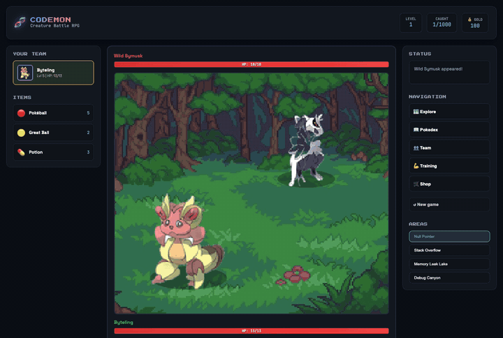

# 🧬 CodeMon: Creature Battle & Collection RPG

A creature-collecting battle RPG in plain HTML, CSS and JavaScript. Pick a starter, explore four areas, battle wild CodeMon, and catch them all — or switch on autoplay and watch it play itself.


-success)

**[▶ Play it in your browser](https://bryanfrds.github.io/Codemon/)**



---

## 🎮 Features

- **Three starters** — Byteling (bug), BitRiot (code) or Flowy (flow).
- **1,000 CodeMon** to catch, each with its own sprite, type, stats and moves.
- **Four areas**, each with its own backdrop and pool of wild CodeMon, tougher the further in you go:

  | Area | CodeMon |
  |---|---|
  | Null Pointer Meadow | #1–280 |
  | Stack Overflow Hills | #241–540 |
  | Memory Leak Lake | #501–780 |
  | Debug Canyon | #741–1000 |

- **Animated battles** — attacks lunge, hits flash and shake with sparks in the move's type colour, damage numbers float up, and HP bars drop when the hit lands.
- **Catching** with Pokéballs and Great Balls; weaken a CodeMon first for better odds.
- **Items** — potions to heal mid-fight.
- **Area guardians**: each area has a guardian, its strongest CodeMon at a fixed level (12, 20, 28, 36) with extra HP. Beat it with the 👑 Guardian button to open the next area and win 200 gold. Guardians can't be caught or run from, and locked areas show a 🔒. On autoplay, it challenges the guardian once the lead reaches its level and moves on to the new area after a win. After a loss it waits until the lead is two levels stronger before trying again.
- **Evolution** — win a fight at level 16 and your CodeMon evolves into a stronger one of the same type, then again at 32. It flashes white as it changes, and evolved CodeMon keep a soft glow in their type's colour, brighter at the final stage.
- **Shop** — spend the gold you win on Pokéballs (40), Great Balls (100) and Potions (25). It's closed during fights. Autoplay restocks on its own when it runs low.
- **Autoplay** — explores, fights, heals and catches on its own.
- **Pokédex** of everything you've caught.
- **Auto-save** in your browser, with a New game button to start over.

Five types: **bug**, **code**, **memory**, **logic** and **flow**. Each one beats the next round a loop and is weak to the one before it:

**bug** → **code** → **logic** → **memory** → **flow** → **bug**

So bug moves hit code creatures for 1.5× damage and flow creatures for about two-thirds. Everything else, including normal moves like Scratch, does normal damage. The move picker tells you which of your moves suit the foe in front of you.

---

## 🚀 How to Run

Play the live version at **https://bryanfrds.github.io/Codemon/**. Your progress saves in that browser.

To run it yourself there's no build step and no dependencies. Either open the file directly:

```bash
open index.html
```

or serve it locally (useful while editing, since it turns browser caching off):

```bash
python3 scripts/serve.py 8777
# then visit http://127.0.0.1:8777
```

Progress saves automatically in your browser, after each battle, when you change area, and every 15 seconds. A reload picks up from the last save, though a fight in progress is lost. **New game** in the navigation panel wipes it (click twice).

---

## 🕹️ How to Play

1. Choose a starter.
2. Walk around with the arrow buttons, or press **ENCOUNTER** to find a wild CodeMon.
3. In battle: **MOVE** to attack, **ITEM** for a potion, **CATCH** to throw a ball, **SWITCH** to swap team members, **RUN** to flee.
4. Beat an area's **👑 Guardian** to open the next one, then change area from the **AREAS** panel to meet different CodeMon.
5. Spend gold in the **SHOP** between fights.
6. Or press **🤖 AUTOPLAY** and let it play.

---

## 📁 Project Structure

```
index.html        page layout
style.css         styling
game.js           game loop, exploration, battle rendering, effects, autoplay
battle.js         battle rules: damage, status moves, catching
creatures.js      the 1,000-species roster, moves, and creature/player classes
sprites.js        loads and draws creature sprites
assets/pixmons/   creature sprites (000.png – 999.png)
assets/bg/        area backdrops
tests/            Node checks for the game rules (node --test tests/*.test.mjs)
scripts/
  gen_roster.py   generates the roster in creatures.js (seeded, so it's reproducible)
  prep_pixmons.py turns the raw Pixmon pack into game-ready sprites
  tint_bg.py      derives the area backdrops from the forest one
  serve.py        local server with caching off
```

Tests use Node's built-in runner, no install needed:

```bash
node --test tests/*.test.mjs
```

To regenerate the roster after editing names or stats in `scripts/gen_roster.py`:

```bash
python3 scripts/gen_roster.py > roster.js   # then paste over CODEMON_SPECIES in creatures.js
```

---

## 🎨 Credits

- **Creature sprites:** [Pixmons](https://www.novelgens.com/pixmons) by NovelGens — 1,000 pixel monsters released into the public domain.
